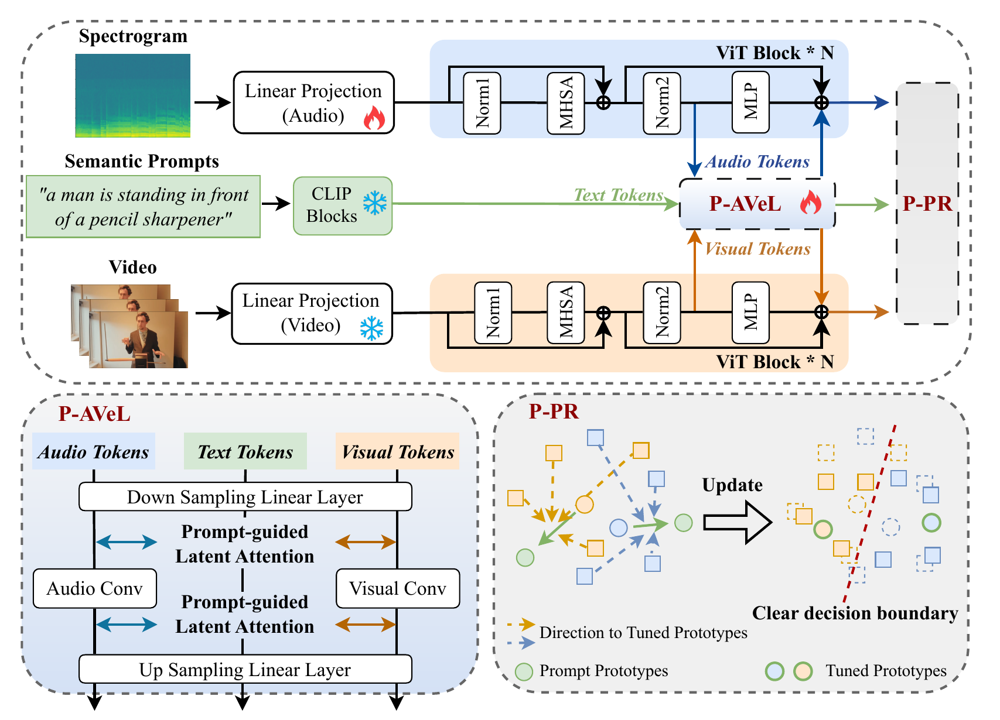
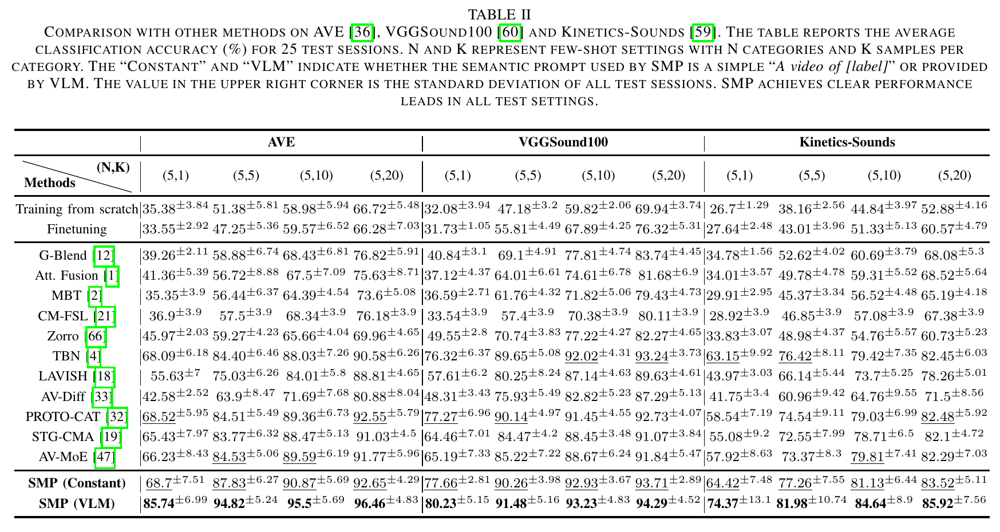
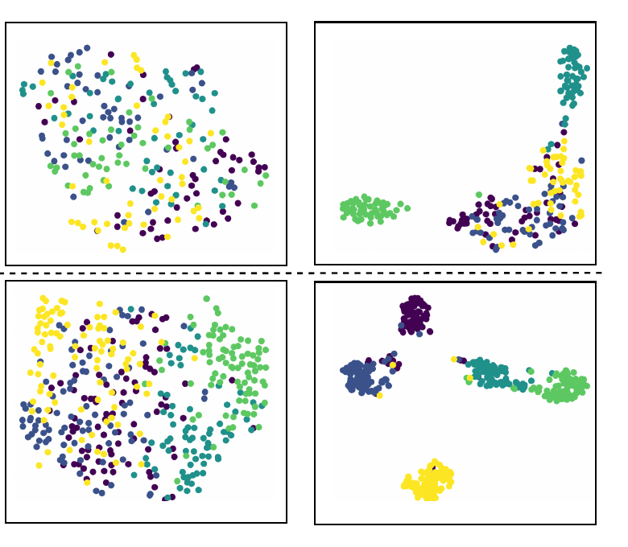

# Semantic Modulated Prompting for Few-Shot Audio-Visual Classification

[](LICENSE)
[](https://www.python.org/)
[](https://pytorch.org/)
[](https://ieeexplore.ieee.org/abstract/document/11352954)

Official PyTorch implementation of **Semantic Modulated Prompting (SMP)** for
few-shot audio-visual classification (FS-AVC).

Published in *IEEE Transactions on Audio, Speech and Language Processing*,
vol. 34, pp. 723-736, 2026. [[IEEE Xplore](https://ieeexplore.ieee.org/abstract/document/11352954)]
[[DOI](https://doi.org/10.1109/TASLPRO.2026.3654246)]

[中文说明](README.zh-CN.md)

## Overview

SMP addresses three difficulties in FS-AVC: overfitting, audio-visual temporal
asynchrony, and modality imbalance. It has two trainable components on top of
mostly frozen ViT and CLIP encoders:

- **Prompt-refined Audio-Visual efficient Learner (P-AVeL):** adapter blocks
  use semantic text prompts to guide latent audio-visual alignment and fusion.
- **Prompt-tuned Prototypical Regularization (P-PR):** text prototypes tune
  audio and visual prototypes before dynamically regularizing the weaker
  modality.

## Framework



*SMP inserts P-AVeL adapters in parallel with the ViT MLP layers for
prompt-guided tri-modal interaction. P-PR then tunes audio and visual
prototypes with semantic prototypes and regularizes the weaker modality.*

## Main results

Experiments use 5-way few-shot classification and report average accuracy over
25 test sessions. With VLM-generated semantic prompts, SMP reaches **85.74%**,
**80.23%**, and **74.37%** in the 1-shot setting on AVE, VGGSound100, and
Kinetics-Sounds, respectively. The corresponding 20-shot results are
**96.46%**, **94.29%**, and **85.92%**. SMP leads all settings reported in the
paper while using 2.56M trainable parameters.



*Main comparison from Table II. Values are mean classification accuracy (%);
superscripts denote the standard deviation across the 25 sessions.*

The t-SNE visualizations below compare LAVISH (left) with SMP (right) on
randomly selected 5-way 1-shot tasks from VGGSound100 (top) and
Kinetics-Sounds (bottom). SMP produces more clearly separated class clusters.



## Repository layout

```text
.
|-- SourcePretraining.py       # source-set pretraining
|-- TargetFS-AVC.py            # N-way K-shot target-set experiments
|-- dataloader/
|   `-- dataset.py             # audio, frame, and caption loading
|-- models/
|   |-- smp.py                 # complete SMP model
|   |-- p_avel.py              # P-AVeL adapter
|   |-- prompt_attention.py    # prompt-guided latent attention
|   |-- smp_fusion_block.py    # tri-stream Transformer block
|   `-- classification_head.py
|-- utils/
|   |-- common.py              # reproducibility and batching helpers
|   |-- prototypes.py          # prototype estimation and P-PR
|   |-- sampling.py            # reproducible few-shot task sampling
|   `-- training.py            # train/evaluation loops
`-- tests/                     # lightweight unit tests
```

## Installation

Python 3.9 or newer is recommended.

```bash
git clone https://github.com/DennisHgj/SMP_FSAVC.git
cd SMP_FSAVC
python -m venv .venv
source .venv/bin/activate  # Windows: .venv\Scripts\activate
pip install -r requirements.txt
```

By default, `timm` downloads `vit_base_patch16_224.augreg_in21k` and
Transformers downloads `openai/clip-vit-large-patch14`. For an offline run,
pass a local ViT checkpoint with `--vit-checkpoint` and a local Hugging Face
CLIP directory with `--text-model`.

## Data preparation

The code expects WAV files, extracted RGB frames, and headerless CSV annotation
files. Audio is resampled to 16 kHz when loaded. Each CSV row has at least three
fields and may include an optional class-name field:

```text
clip_id,integer_label,semantic_prompt[,class_name]
```

`semantic_prompt` is consumed verbatim. It can be a caption generated by a VLM
such as [mPLUG-2](https://github.com/X-PLUG/mPLUG-2), or the fixed static prompt
`a video of [label]` in every row. `[label]` is literal text and is not replaced
with a class name. VGGSound100 annotations may use the fourth column to retain
the human-readable class name; this column is not passed to the model.

The corresponding media are resolved as:

```text
<audio-dir>/<clip_id>.wav
<visual-dir>/<clip_id>/<frame files>
```

Frames are sorted by filename and eight uniformly spaced frames are used by
default. Source-set labels must use the dataset's zero-based source label
space; empty indices are accepted only when the missing-class policy allows
them. A typical annotation layout is:

```text
annotations/
|-- source/
|   |-- pretrain.csv
|   `-- pretrain_test.csv
`-- target/
    |-- fewshot.csv
    `-- fewshot_test.csv
```

The paper uses the following source/target split sizes:

| Dataset | Source classes | Target classes |
| --- | ---: | ---: |
| AVE | 16 | 12 |
| VGGSound100 | 60 | 40 |
| Kinetics-Sounds | 19 | 13 |

The available VGGSound100 split retains the source label space `0..59`, but
source label `14` has no obtainable media. By default, pretraining warns once
and keeps an all-zero prototype for this class, matching the research code.
Use `--missing-class-policy error` to reject any split with an empty source
class instead.

The exact split CSVs and mPLUG-2 captions used in the paper are released in the
[SMP_FSAVC_Dataset repository](https://github.com/DennisHgj/SMP_FSAVC_Dataset).
Source media are not redistributed; obtain them from the upstream datasets and
follow their licenses and usage terms. For the static-prompt setting, every
sample uses the identical literal string `a video of [label]`.

## Source-set pretraining

The defaults reproduce the main architecture settings from the paper:
P-AVeL starts at Transformer block 4, uses a downsampling dimension of 16,
applies prompt-guided latent attention before and after modality convolutions,
and places P-AVeL parallel to the MLP sublayer.

```bash
python SourcePretraining.py \
  --dataset AVE \
  --num-classes 16 \
  --annotation-root /path/to/annotations/source \
  --audio-dir /path/to/audio_files \
  --visual-dir /path/to/rgb_frames \
  --output-dir checkpoints
```

Use `python SourcePretraining.py --help` for all options. The best validation
checkpoint is written to `<output-dir>/<experiment-name>.pt`.

## Few-shot target training

The command below runs the paper's 5-way 1-shot protocol. Five class draws and
five support-set draws per class set produce 25 sessions.

```bash
python TargetFS-AVC.py \
  --dataset AVE \
  --few-shot-root /path/to/annotations/target \
  --audio-dir /path/to/audio_files \
  --visual-dir /path/to/rgb_frames \
  --pretrained-model checkpoints/smp_ave_source.pt \
  --n-way 5 \
  --k-shot 1
```

Session metrics and aggregate mean/standard deviation are saved as JSON in
`results/` by default. To reproduce 5-, 10-, or 20-shot experiments, change
only `--k-shot`.

> **Evaluation note:** the released research protocol selects the best query
> accuracy across fine-tuning epochs for each session. This matches the paper's
> reported experimental code, but it uses query labels for epoch selection.
> For deployment or a strict held-out evaluation, select the epoch using a
> separate validation split and evaluate the query set only once.

## Reproducibility notes

- The default seed is 42, as in the paper.
- The default optimizer is Adam with learning rate `1e-4` and batch size 16.
- ViT Transformer weights are frozen except the selected norm/bias tuning
  parameters. The audio patch projection, both positional embeddings and CLS
  tokens, and both final norms remain trainable as in the research code. The
  CLIP text encoder stays frozen; P-AVeL and the classifier are trainable.
- Source checkpoints produced by this repository are supported. Checkpoints
  from different model architectures are not compatible.
- Exact results also depend on media preprocessing, generated captions,
  package versions, and hardware.

## Tests

```bash
python -m unittest discover -s tests -v
```

These tests cover prototype computation, P-PR loss construction, deterministic
few-shot sampling, and latent-attention tensor shapes. Full training requires
the datasets and pretrained encoder weights.

## Citation

If this work is useful in your research, please cite the published article
([IEEE Xplore](https://ieeexplore.ieee.org/abstract/document/11352954)).

```bibtex
@ARTICLE{11352954,
  author={Huang, Guanjie and Cui, Yawen and Tsang, Danny H.K. and Wang, Wenwu and Liu, Li},
  journal={IEEE Transactions on Audio, Speech and Language Processing},
  title={Semantic Modulated Prompting for Few-Shot Audio-Visual Classification},
  year={2026},
  volume={34},
  pages={723-736},
  doi={10.1109/TASLPRO.2026.3654246}
}
```

## License

This project is released under the [GNU General Public License v3.0](LICENSE).
